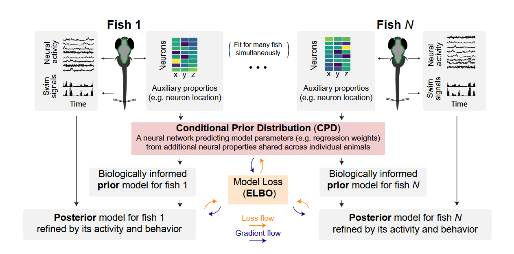

# Deep Probabilistic Model Synthesis (DPMS)

William E. Bishop<sup>1*</sup>, Luuk W. Hesselink<sup>2,3</sup>, Bernhard Englitz<sup>2,3</sup>, Misha B. Ahrens<sup>1†</sup>, James E. Fitzgerald<sup>1,4†</sup>  

<sup>1</sup>Janelia Research Campus, HHMI, Ashburn, VA, USA  
<sup>2</sup>Department of Neurophysiology, Radboud University, Nijmegen, The Netherlands  
<sup>3</sup>Donders Institute for Brain, Cognition, and Behaviour, Radboud University, Nijmegen, The Netherlands  
<sup>4</sup>Department of Neurobiology, Northwestern University, Evanston, IL, USA  
<sup>*</sup>Correspondence: [willbishop.neuro@gmail.com](mailto:willbishop.neuro@gmail.com)  
<sup>†</sup>Equal contribution

---

## Overview

**Deep Probabilistic Model Synthesis (DPMS)** is a machine learning framework for synthesizing machine learning models across multiple instances of a general system, here applied to individual animals in a neuroscientific context.

DPMS uses variational inference to jointly learn:

- A **conditional prior distribution (CPD)** that captures common structure across systems
- **Posterior distributions** that model each system instance individually

This approach enables generalization and interpretability in settings such as regression, classification, and dimensionality reduction. We demonstrate its utility on synthetic datasets and neural recordings from larval zebrafish.

For more details, read the manuscript:  
**Deep Probabilistic Model Synthesis**  
*(DOI)*



---

## Repository Contents

- `/probabilistic_model_synthesis/`: Code implementing DPMS, including helper functions
- `/data_handling_notebooks/`: Notebooks generating fold and segments structures necessary for figures 3 and 5
- `/figures/figure*`: Folders containing code necessary to (qualitatively) reproduce all figures

---

## Data

This project uses whole-brain light-sheet imaging data from larval zebrafish fictively behaving in a virtual environment. The imaging setup is described in:

> Vladimirov et al., *Nature Methods*, 2014  
> https://www.nature.com/articles/nmeth.3040

The data used here is from:

> Chen*, Mu*, Hu* et al., *Neuron*, 2018  
> DOI: [10.1016/j.neuron.2018.09.042](https://doi.org/10.1016/j.neuron.2018.09.042)  
> Available at: [https://doi.org/10.25378/janelia.7272617](https://doi.org/10.25378/janelia.7272617)

Please cite these works when using the data.

---

## Setup Instructions

### 1. Clone the necessary repositories

```bash
git clone https://github.com/neuro-will/janelia_core
git clone https://github.com/neuro-will/probabilistic_model_synthesis
```

The `janelia_core` repository contains supporting functionality for setting up models, visualization, etc.

### 2. Create and activate the conda environment

```bash
conda create -n dpms python=3.8
conda activate dpms
```

### 3. Install the dependencies

```bash
cd /path/to/janelia_core/
pip install -e .

cd /path/to/probabilistic_model_synthesis/
pip install -e .
```

### 4. Install PyTorch

Follow the Pytorch installation instructions at:  
[https://pytorch.org/get-started/locally](https://pytorch.org/get-started/locally)

---

## Reproducing Results and Figures

The results in the manuscript were generated using pre-saved outputs in the `publication_results` directory. You can re-run the code to generate new results, which should qualitatively match those in the paper.

### Download the data

The data is available at [https://doi.org/10.25378/janelia.7272617](https://doi.org/10.25378/janelia.7272617). 
The data should be saved to `/data/` so that parameter files directly point to the correct file paths.

### Synthetic Example (Figure 2)

To train all models, run:

```bash
python /figures/figure2/fit_one_dim_synthesis_example.py
```

After models have been trained, the resulting figures can be generated by running the following Jupyter notebook:

```bash
/figures/figure2/vis_one_dim_synthesis_example.ipynb
```

### Real Data - Same-Condition Regression (Figure 3)

To train all models, run:

```bash
python /figures/figure3/run_full_transfer_analysis.py
```

Please note that (sentences about cluster setup etc.)

After models have been trained, the resulting figures can be generated by running the following Jupyter notebook:

```bash
/figures/figure3/generate_transfer_analysis_plots.ipynb
```

### Real Data - Cross-Condition FA (Figures 4, 5, and A2)

**Qualitative FA (figure 4):**

```bash
/figures/figure4/across_cond_synthesis_example.ipynb
```

**Quantitative FA (figure 5 and figure A2):**

To train all models, run:

```bash
python /figures/figure5_andA2/run_full_transfer_analysis.py
```

After models have been trained, the resulting figures can be generated by running the following Jupyter notebook:

```bash
/figures/figure5_and_A2/make_across_cond_plots.ipynb
```

### Supplemental Figure A1

```bash
python /figures/figureA1/linear_regression_synthesis.py
```

---

## Notes on Parameters, and Segments and Fold Files

Model fitting and data segmentation parameters are provided in the project repository and are used to generate the above figures. These files are stored in:

- `/data/fold_and_segment_structures`

Fold structure files are unused in the current code setup.

If data locations are changed from the standard path (`/data`) or you would like to edit them to change the model training setup, it is possible to regenerate the parameter files for the gnlr and gnldr models by running:

```bash
python /figure3/generate_syn_params.py
```

and/or

```bash
python /figure5/generate_syn_params.py
```


Although unlikely to be necessary, segment and fold structures can furthermore be edited and regenerated by running:

```bash
python /fold_and_segments_generation/Fill in
```

and

```bash
python /fold_and_segments_generation/Fill in
```

---

## Contact

For questions regarding the project, please contact:

- William Bishop: [willbishop@gmail.com](mailto:willbishop@gmail.com)

